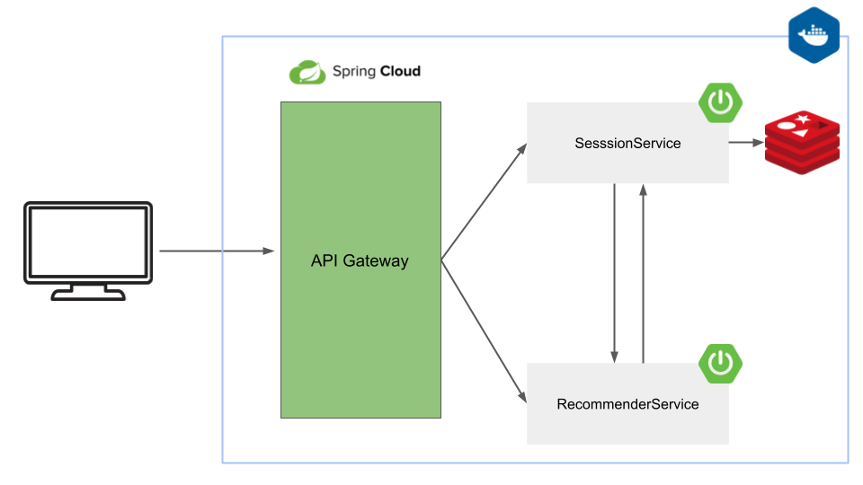

# OpenAIRecommender

A book recommender web application. However,instead of your typical machine learning algorithm, we used OpenAI's API to recommend books for users instead. This the core of this project consists of a Spring Boot backend and a React Frontend.

## Architecture/ How this works




I wanted to develop a mini-microservice archictecture with two services. Heres a general overview of the overall architecture.

| Service   | Purpose  |
|------------|------------|
| SessionService   | User Sessions are stored redis through Spring Boots HTTPsession. These sessions are used to persist the users books. Acts as a client to the ReccommenderApplication   |
| ReccommenderService   | Caller of the OpenAI API. Takes the current session from the SessionApplication and responds with a list of recommendations for the user.    |
| API Gateway   | Simply for API routing purposes. Not needed but wanted to try it out for the project  |

These are all run in docker containers which will be explained below.


## Run Locally

This project can be easily setup using a docker-compose command. However, since we are using the OpenAI API, you will need to setup 

```bash
  git clone https://github.com/cakuang1/movierec.git
```

Go to the project directory

```bash
  cd movierec
```

Run the docker compose commnad

```bash
  docker compose up
```

| Service            | Port(s)       | Description                              |
|--------------------|---------------|------------------------------------------|
| `redis`            | 6379          | Redis service for caching.               |
| `moviemanagement`  | 8080          | Spring Boot application for movie management, depends on Redis. |
| `recc`             | 8081          | Reccomendation service (OpenAI  )    |
| `apigateway`       | 8085          | API Gateway service, dependent on Redis.                        |
| `frontend`         | 3000          | Frontend service for your application.                            |

These following services will be now running.

Now you are able to view to web application by going to 

```bash
  npm run start
```


## Demo


## Tools used 
